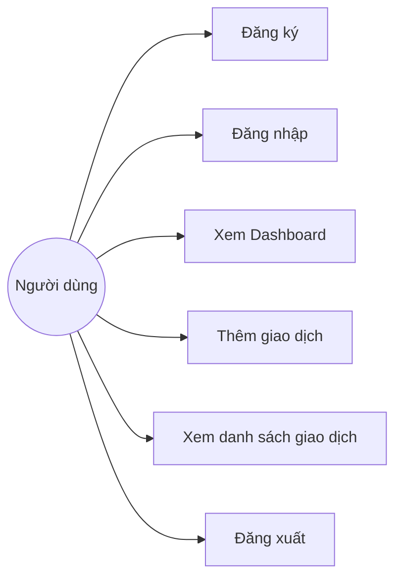
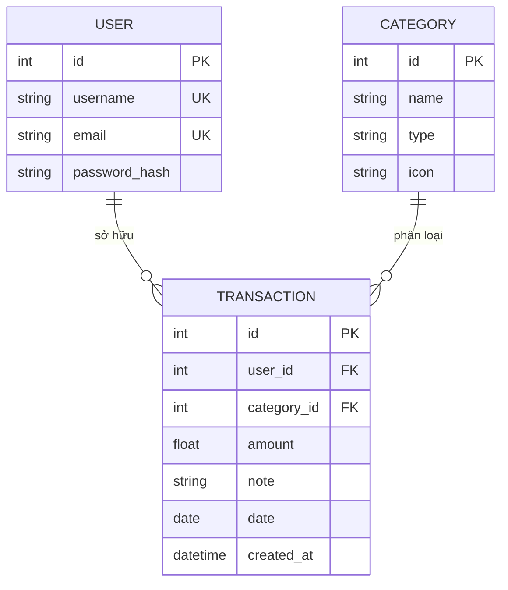
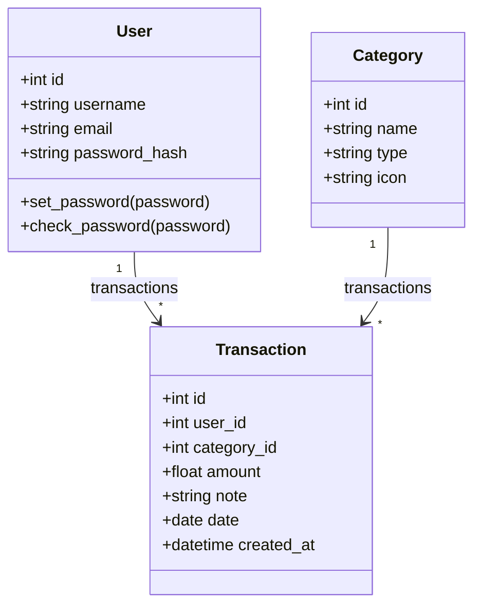
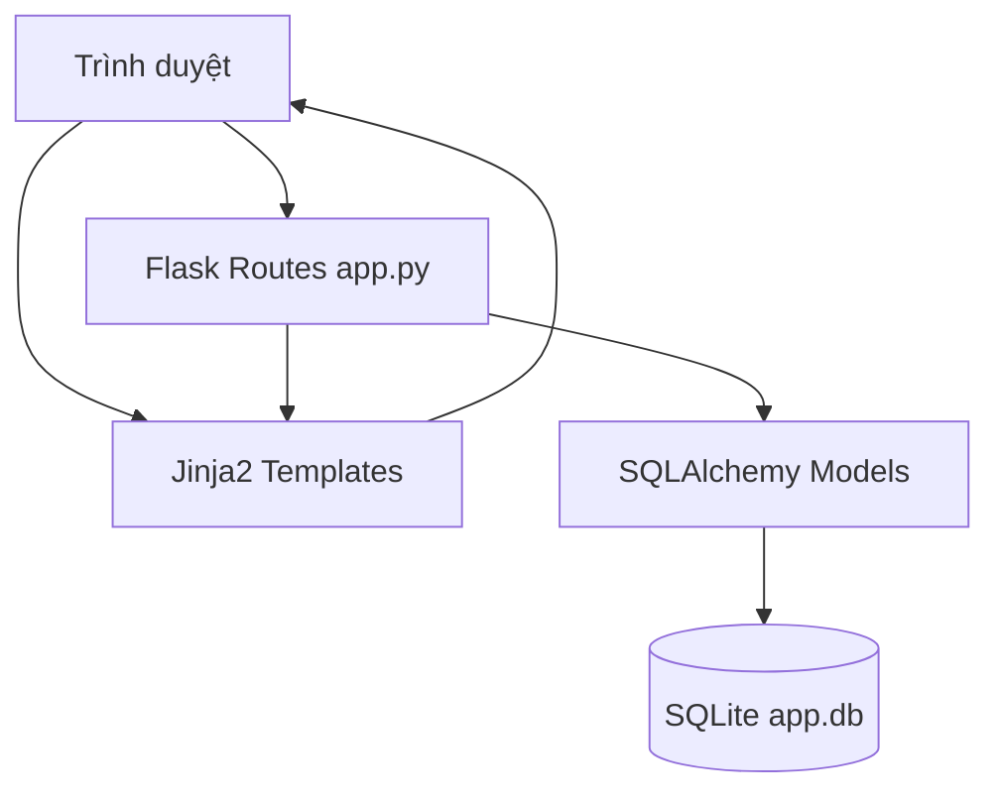
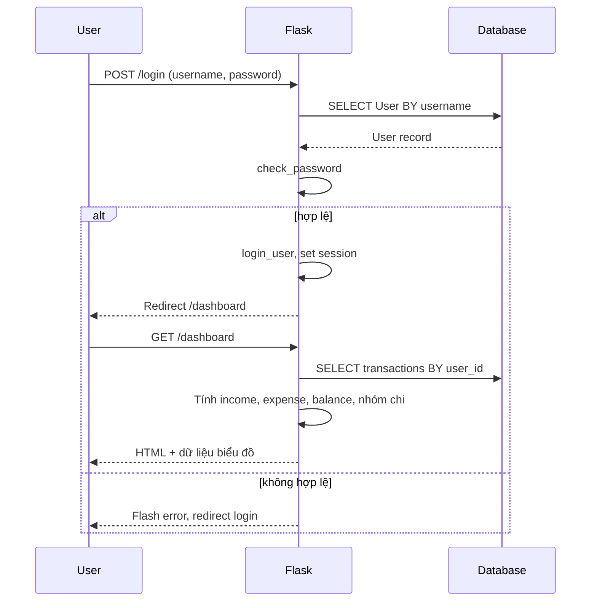
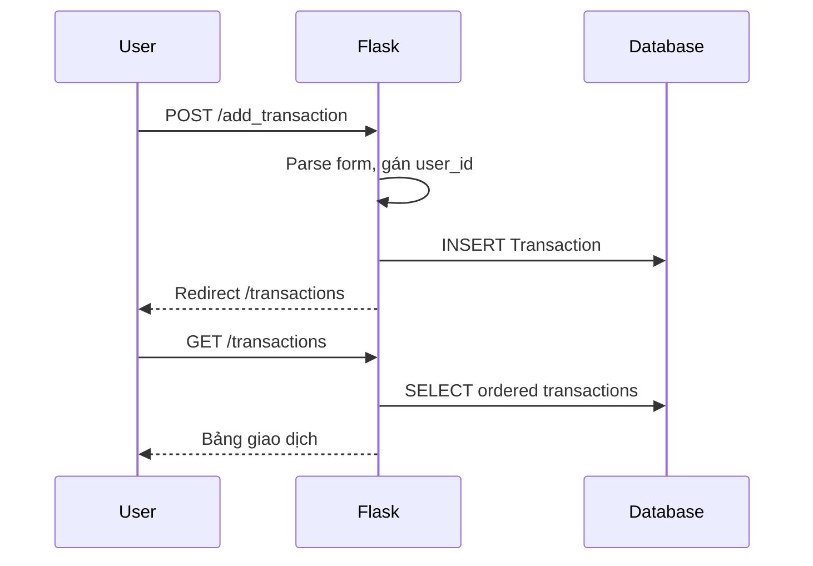

# TÀI LIỆU PHÂN TÍCH VÀ THIẾT KẾ PHẦN MỀM
## Ứng dụng Quản lý Tài chính Cá nhân (Personal Finance Manager)

---

## MỤC LỤC

1. [Giới thiệu](#1-giới-thiệu)
2. [Phân tích hệ thống](#2-phân-tích-hệ-thống)
3. [Thiết kế các đối tượng](#3-thiết-kế-các-đối-tượng)
4. [Thuật toán và xử lý nghiệp vụ](#4-thuật-toán-và-xử-lý-nghiệp-vụ)
5. [Kiến trúc phần mềm](#5-kiến-trúc-phần-mềm)
6. [Luồng xử lý chính](#6-luồng-xử-lý-chính)
7. [Giao diện người dùng](#7-giao-diện-người-dùng)
8. [Hạn chế và hướng phát triển](#8-hạn-chế-và-hướng-phát-triển)

---

## 1. GIỚI THIỆU

### 1.1. Mô tả chương trình phần mềm

**Finance App** là ứng dụng web quản lý tài chính cá nhân, cho phép người dùng ghi nhận thu nhập và chi tiêu theo danh mục, theo dõi số dư và xem báo cáo trực quan trên bảng điều khiển (dashboard).

Phần mềm được xây dựng theo mô hình **ứng dụng web ba lớp** (presentation – business logic – data):

| Thành phần | Công nghệ |
|------------|-----------|
| Backend | Python 3, Flask 3.0 |
| Cơ sở dữ liệu | SQLite qua Flask-SQLAlchemy |
| Xác thực | Flask-Login, Werkzeug (mã hóa mật khẩu) |
| Giao diện | Jinja2, Bootstrap 5, Chart.js |
| Cấu hình | Biến môi trường / `config.py` |

### 1.2. Mục tiêu và phạm vi

- **Mục tiêu:** Hỗ trợ người dùng theo dõi dòng tiền cá nhân: tổng thu, tổng chi, số dư và phân bổ chi tiêu theo danh mục.
- **Phạm vi hiện tại:** Đăng ký/đăng nhập, thêm giao dịch, xem danh sách giao dịch, dashboard với biểu đồ.
- **Đối tượng sử dụng:** Cá nhân quản lý chi tiêu hàng ngày (đồ án / demo quy mô nhỏ).

### 1.3. Cấu trúc thư mục dự án

```text
finance_app/
├── app.py              # Điểm vào, định nghĩa route và khởi tạo DB
├── models.py           # Mô hình dữ liệu (ORM)
├── config.py           # Cấu hình ứng dụng
├── extensions.py       # Khởi tạo db, LoginManager
├── requirements.txt    # Phụ thuộc Python
├── static/
│   ├── css/style.css
│   └── js/charts.js    # Biểu đồ Chart.js
└── templates/
    ├── base.html
    ├── dashboard.html
    ├── transactions.html
    ├── login.html
    └── register.html
```

---

## 2. PHÂN TÍCH HỆ THỐNG

### 2.1. Yêu cầu chức năng

| STT | Chức năng | Mô tả | Trạng thái |
|-----|-----------|-------|------------|
| F1 | Đăng ký tài khoản | Tạo user mới với username, email, mật khẩu mã hóa | Đã triển khai |
| F2 | Đăng nhập / Đăng xuất | Xác thực session qua Flask-Login | Đã triển khai |
| F3 | Dashboard | Tổng thu, tổng chi, số dư, biểu đồ chi theo danh mục | Đã triển khai |
| F4 | Thêm giao dịch | Form modal: số tiền, danh mục, ngày, ghi chú | Đã triển khai |
| F5 | Danh sách giao dịch | Bảng sắp xếp theo ngày giảm dần | Đã triển khai |
| F6 | Sửa / Xóa giao dịch | Nút trên UI | Chưa nối backend |
| F7 | Quản lý danh mục (CRUD) | Thêm/sửa/xóa category | Chưa triển khai (seed mặc định) |
| F8 | Lọc theo tháng/danh mục | Bộ lọc giao dịch | Chưa triển khai |

### 2.2. Yêu cầu phi chức năng

- **Bảo mật:** Mật khẩu lưu dạng hash (Werkzeug); route nhạy cảm dùng `@login_required`; mỗi giao dịch gắn `user_id` của người đăng nhập.
- **Khả năng mở rộng:** Tách `models`, `config`, `extensions` để dễ bổ sung module (forms, API).
- **Giao diện:** Responsive (Bootstrap), biểu đồ tương tác (Chart.js).

### 2.3. Sơ đồ use case (tóm tắt)



### 2.4. Quan hệ thực thể (ER)



- Một **User** có nhiều **Transaction** (1–N).
- Một **Category** có nhiều **Transaction** (1–N).
- **Category** dùng chung cho toàn hệ thống (chưa tách theo user).

---

## 3. THIẾT KẾ CÁC ĐỐI TƯỢNG

### 3.1. Lớp `User` (Người dùng)

**Vai trò:** Đại diện tài khoản đăng nhập; kế thừa `UserMixin` (Flask-Login) và `db.Model` (SQLAlchemy).

| Thuộc tính | Kiểu | Mô tả |
|------------|------|--------|
| `id` | Integer, PK | Khóa chính |
| `username` | String(64), unique, index | Tên đăng nhập |
| `email` | String(120), unique, index | Email |
| `password_hash` | String(256) | Mật khẩu đã băm |
| `transactions` | Relationship | Danh sách giao dịch (`lazy='dynamic'`) |

**Phương thức:**

| Phương thức | Mô tả |
|-------------|--------|
| `set_password(password)` | Gọi `generate_password_hash`, gán vào `password_hash` |
| `check_password(password)` | So sánh mật khẩu nhập với hash qua `check_password_hash` |

**Thiết kế:** Che giấu mật khẩu thô — chỉ lưu hash, không lưu plaintext.

---

### 3.2. Lớp `Category` (Danh mục)

**Vai trò:** Phân loại giao dịch thành Thu (Income) hoặc Chi (Expense).

| Thuộc tính | Kiểu | Mô tả |
|------------|------|--------|
| `id` | Integer, PK | Khóa chính |
| `name` | String(64) | Tên danh mục (vd: Lương, Ăn uống) |
| `type` | String(20) | `'Income'` hoặc `'Expense'` |
| `icon` | String(64) | Tên icon Bootstrap Icons |
| `transactions` | Relationship | Các giao dịch thuộc danh mục |

**Dữ liệu khởi tạo mặc định** (trong `app.py` khi chạy lần đầu):

- Thu: Lương, Thưởng  
- Chi: Ăn uống, Di chuyển, Mua sắm  

---

### 3.3. Lớp `Transaction` (Giao dịch)

**Vai trò:** Bản ghi một khoản thu hoặc chi của user tại một thời điểm.

| Thuộc tính | Kiểu | Mô tả |
|------------|------|--------|
| `id` | Integer, PK | Khóa chính |
| `user_id` | Integer, FK → User | Chủ sở hữu giao dịch |
| `category_id` | Integer, FK → Category | Loại thu/chi |
| `amount` | Float | Số tiền (luôn dương; dấu hiển thị theo `category.type`) |
| `note` | String(200) | Ghi chú tùy chọn |
| `date` | Date, index | Ngày giao dịch |
| `created_at` | DateTime | Thời điểm tạo bản ghi |

**Quan hệ ngược (backref):**

- `transaction.author` → `User`
- `transaction.category` → `Category`

---

### 3.4. Đối tượng cấu hình và tiện ích

#### Lớp `Config` (`config.py`)

| Thuộc tính | Giá trị | Ý nghĩa |
|------------|---------|---------|
| `SECRET_KEY` | Env hoặc mặc định | Ký session Flask |
| `SQLALCHEMY_DATABASE_URI` | SQLite `app.db` | Đường dẫn CSDL |
| `SQLALCHEMY_TRACK_MODIFICATIONS` | `False` | Tắt theo dõi thừa |

#### Module `extensions`

- `db`: instance `SQLAlchemy` — ORM toàn cục.
- `login`: `LoginManager`, `login_view = 'login'` — chuyển hướng khi chưa đăng nhập.

#### Hàm `load_user(id)` (`models.py`)

- Callback của Flask-Login: nạp `User` theo `id` từ session.

---

### 3.5. Sơ đồ lớp (Class Diagram)



---

## 4. THUẬT TOÁN VÀ XỬ LÝ NGHIỆP VỤ

### 4.1. Thuật toán xác thực đăng nhập

**Đầu vào:** `username`, `password` (form POST)  
**Đầu ra:** Session đăng nhập hoặc thông báo lỗi

```
1. Nếu current_user đã xác thực → chuyển hướng dashboard
2. user ← truy vấn User theo username
3. Nếu user không tồn tại HOẶC check_password thất bại:
       flash lỗi → redirect login
4. Ngược lại: login_user(user) → redirect dashboard
```

**Độ phức tạp:** O(1) truy vấn có index trên `username`.

---

### 4.2. Thuật toán đăng ký

```
1. Nếu đã đăng nhập → redirect dashboard
2. Tạo User(username, email)
3. user.set_password(password)
4. db.session.add(user); commit
5. flash thành công → redirect login
```

*Lưu ý thiết kế:* Chưa kiểm tra trùng username/email trước khi insert (có thể lỗi unique constraint từ DB).

---

### 4.3. Thuật toán tính tổng thu, tổng chi và số dư (Dashboard)

**Đầu vào:** Tập giao dịch `T` của `current_user.id`

```python
total_income  = Σ t.amount  với mọi t ∈ T mà t.category.type == 'Income'
total_expense = Σ t.amount  với mọi t ∈ T mà t.category.type == 'Expense'
balance       = total_income - total_expense
```

**Pseudocode:**

```
transactions ← filter(Transaction, user_id = current_user.id)
total_income ← 0
total_expense ← 0
FOR EACH t IN transactions:
    IF t.category.type == 'Income':
        total_income ← total_income + t.amount
    ELSE IF t.category.type == 'Expense':
        total_expense ← total_expense + t.amount
balance ← total_income - total_expense
```

**Độ phức tạp:** O(n) với n = số giao dịch của user (mỗi phần tử truy cập quan hệ `category`).

---

### 4.4. Thuật toán nhóm chi tiêu theo danh mục (biểu đồ Doughnut)

**Mục đích:** Tạo `expenses_by_cat: Dict[name → tổng tiền]` chỉ với giao dịch Expense.

```
expenses_by_cat ← {}
FOR EACH t IN transactions:
    IF t.category.type == 'Expense':
        name ← t.category.name
        expenses_by_cat[name] ← expenses_by_cat.get(name, 0) + t.amount
RETURN keys(expenses_by_cat), values(expenses_by_cat)
```

**Độ phức tạp:** O(n). Cấu trúc dữ liệu: **dictionary** (bảng băm) để cộng dồn theo tên danh mục.

---

### 4.5. Thuật toán thêm giao dịch

**Đầu vào:** `amount`, `category_id`, `note`, `date` (form POST)

```
1. Parse amount ← float(form)
2. Parse category_id ← int(form)
3. Nếu date rỗng → date ← ngày UTC hiện tại
   Ngược lại → parse '%Y-%m-%d'
4. Tạo Transaction(user_id=current_user.id, ...)
5. Lưu DB, flash, redirect /transactions
```

**Ràng buộc nghiệp vụ ngầm:** Loại Thu/Chi do `Category.type` quyết định, không nhập trực tiếp trên form.

---

### 4.6. Thuật toán liệt kê giao dịch

```
user_transactions ← Transaction.filter(user_id=current_user.id)
                      .order_by(Transaction.date.desc())
                      .all()
categories ← Category.query.all()
```

**Sắp xếp:** Theo `date` giảm dần (giao dịch mới nhất trước).

---

### 4.7. Khởi tạo cơ sở dữ liệu

```
WITH app.app_context():
    db.create_all()
    IF Category.query.first() IS NULL:
        bulk_save_objects([5 category mặc định])
        commit
```

---

## 5. KIẾN TRÚC PHẦN MỀM

### 5.1. Mô hình MVC trên Flask

| Lớp MVC | Thành phần trong dự án |
|---------|-------------------------|
| **Model** | `models.py` — User, Category, Transaction |
| **View** | `templates/*.html` — Jinja2 render HTML |
| **Controller** | `app.py` — route xử lý request, gọi model, trả view |

### 5.2. Sơ đồ kiến trúc tổng quan



### 5.3. Bảng ánh xạ Route – Chức năng

| Route | Method | Bảo vệ | Chức năng |
|-------|--------|--------|-----------|
| `/`, `/dashboard` | GET | `@login_required` | Dashboard + thống kê |
| `/login` | GET, POST | Public | Đăng nhập |
| `/logout` | GET | Public | Đăng xuất |
| `/register` | GET, POST | Public | Đăng ký |
| `/transactions` | GET | `@login_required` | Danh sách giao dịch |
| `/add_transaction` | POST | `@login_required` | Thêm giao dịch |

---

## 6. LUỒNG XỬ LÝ CHÍH

### 6.1. Luồng đăng nhập và truy cập Dashboard



### 6.2. Luồng thêm giao dịch



---

## 7. GIAO DIỆN NGƯỜI DÙNG

### 7.1. Cấu trúc giao diện

- **`base.html`:** Navbar, flash messages, nạp Bootstrap + Chart.js + `charts.js`.
- **`dashboard.html`:** 3 card (Income, Expense, Balance); canvas biểu đồ tròn và đường.
- **`transactions.html`:** Bảng responsive + modal thêm giao dịch.
- **`login.html` / `register.html`:** Form xác thực.

### 7.2. Trình bày dữ liệu trên View

- Số tiền format `%.2f`, prefix `$`.
- Giao dịch Income: màu xanh, dấu `+`; Expense: đỏ, dấu `-`.
- Icon danh mục: class Bootstrap `bi {{ category.icon }}`.

### 7.3. Biểu đồ (`charts.js`)

| Biểu đồ | Nguồn dữ liệu | Loại Chart.js |
|---------|----------------|---------------|
| Chi theo danh mục | `expenses_labels`, `expenses_data` từ Flask | Doughnut |
| Diễn biến số dư 7 ngày | Dữ liệu **mock** cố định trong JS | Line |

---

## 8. HẠN CHẾ VÀ HƯỚNG PHÁT TRIỂN

### 8.1. Hạn chế hiện tại

- Nút Sửa/Xóa giao dịch trên UI chưa có route xử lý.
- Biểu đồ đường số dư chưa tính từ DB thật.
- Category dùng chung, chưa CRUD cho user.
- Chưa có phân trang, lọc theo tháng/năm.
- Chưa validate form server-side (Flask-WTF).

### 8.2. Đề xuất mở rộng thiết kế

1. Bổ sung lớp **service** (vd: `FinanceService`) tách logic tính toán khỏi route.
2. API REST hoặc AJAX cho CRUD giao dịch không reload trang.
3. Thuật toán **số dư theo ngày**: duyệt giao dịch theo `date`, tích lũy `balance[t]` cho Line Chart thật.
4. Gắn `user_id` vào `Category` nếu mỗi user có danh mục riêng.
5. Thêm **pagination** (SQLAlchemy `.paginate`) cho bảng giao dịch.

---

## PHỤ LỤC: PHỤ THUỘC PHẦN MỀM

```
Flask==3.0.0
Flask-SQLAlchemy==3.1.1
Flask-Login==0.6.3
Werkzeug==3.0.0
```

**Cách chạy:**

```bash
cd finance_app
pip install -r requirements.txt
python app.py
```

Truy cập `http://127.0.0.1:5000` — đăng ký tài khoản, đăng nhập và sử dụng dashboard cùng quản lý giao dịch.

---

*Tài liệu được lập theo mã nguồn thực tế trong thư mục `finance_app/` — phục vụ báo cáo phân tích và thiết kế đồ án.*
